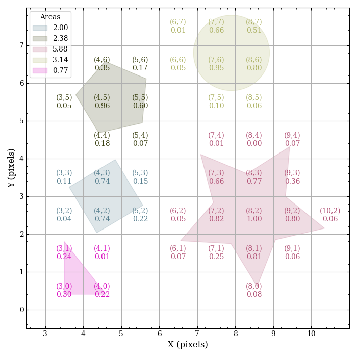
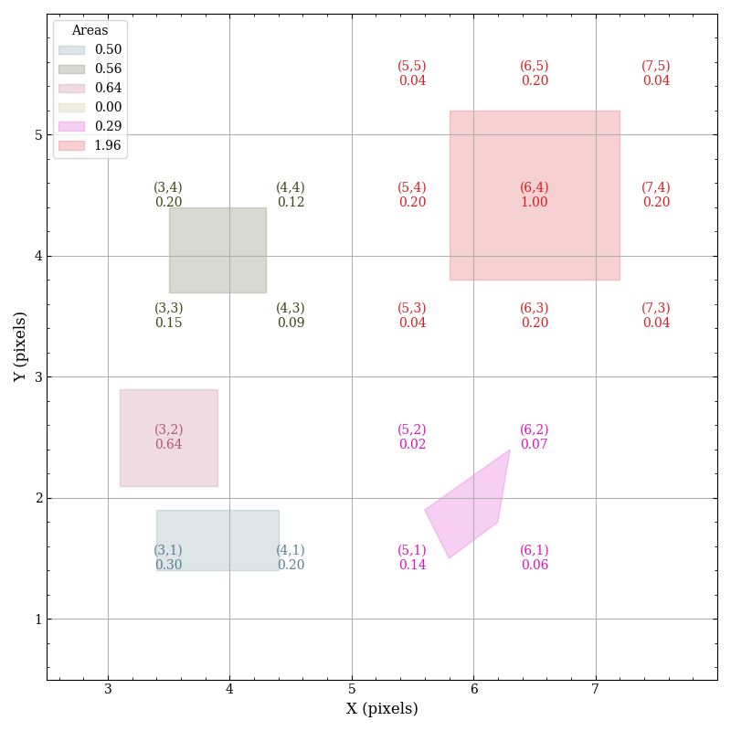

# pypolyclip

[](https://github.com/spacetelescope/pypolyclip/actions/workflows/ci_workflows.yml) [](https://codecov.io/github/spacetelescope/pypolyclip)

A python driver for
[polyclip](http://tir.astro.utoledo.edu/jdsmith/code/idl.php) written in
C by J.D. Smith.

The polyclip functions were originally developed for the CUBISM
project [Smith et al. 2007 (PASP 119, 1133)](https://ui.adsabs.harvard.edu/abs/2007PASP..119.1133S/).


## Installation

The package can be installed using pip from the command line:
```
pip install pypolyclip
```

## Description
The [polyclip](http://tir.astro.utoledo.edu/jdsmith/code/idl.php)
code employs the [Sutherland-Hodgman
algorithm](https://en.wikipedia.org/wiki/Sutherland–Hodgman_algorithm)
to clip simple polygons against a tessalated grid of square pixels.
Therefore, this differs from similar packages, which often clip between
two arbitrary polygons. The testing function `test/test_pypolyclip.py`
can be invoked to produce the following example figures:




The first figure shows clipping of polygons with differing numbers of
vertices. Programmatically, this requires explicit for-loops in Python,
but if the number of vertices is the same for all polygons (such as
the second figure), the `numpy` can be used to improve performance by
several percent. In each figure, the Cartesian coordinates for each
pixel that overlaps with a given polygon are labeled with the area of
that pixel that is covered (recalling the area of a pixel is defined as
1). Therefore, the sum of the areas of the individual pixels for each
polygon should be the area of the polygon.

## Example usage
This first example demonstrates polygons with the same number of
vertices:

```
# import relevant modules
import pypolyclip
import numpy as np

# define the size of the pixel grid
naxis = (100, 100)

# create 3 polygons to clip

# the x-vertices of the polygon
px = np.array([[3.4, 3.4, 4.4, 4.4],
               [3.5, 3.5, 4.3, 4.3],
               [3.1, 3.1, 3.9, 3.9]], dtype=float)

# the y-vertices of the polygon
py = np.array([[1.4, 1.9, 1.9, 1.4],
               [3.7, 4.4, 4.4, 3.7],
               [2.1, 2.9, 2.9, 2.1]], dtype=float)

# call the clipper
xc, yc, area, slices = pypolyclip.multi(px, py, naxis)

# xc, yc are the coordinates in the grid
# area is the relative pixel area in that grid cell
# slices is a list of slice objects to link between the polygons and clipped pixel grid

# use these things like
for i, s in enumerate(slices):
    print(f'total area for polygon {i}={np.sum(area[s])}')

```

This second example demonstrates polygons with the different number of
vertices (notice the difference is in the datatype of the `px` and `py`
variables):

```
# import relevant modules
import pypolyclip
import numpy as np

# define the size of the pixel grid
naxis = (100, 100)

# create 3 polygons to clip

# the x-vertices of the polygon
px = [[3.4, 3.4, 4.4, 4.8, 4.4],
      [3.5, 3.5, 4.3, 4.3],
      [3.1, 3.8, 3.1]]

# the y-vertices of the polygon
py = [[1.4, 1.9, 1.9, 1.65, 1.4],
      [3.7, 4.4, 4.4, 3.7],
      [2.1, 2.1, 3.4]]

# call the clipper
xc, yc, area, slices = pypolyclip.multi(px, py, naxis)

# xc, yc are the coordinates in the grid
# area is the relative pixel area in that grid cell
# slices is a list of slice objects to link between the polygons and clipped pixel grid

# use these things like
for i, s in enumerate(slices):
    print(f'total area for polygon {i}={np.sum(area[s])}')
```

See also `test/test_pypolyclip.py` for examples.
